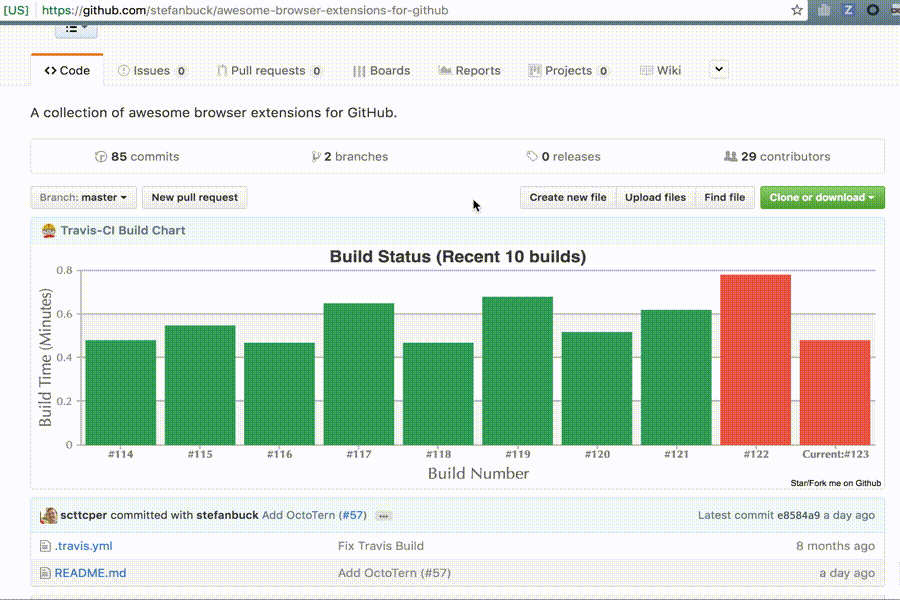
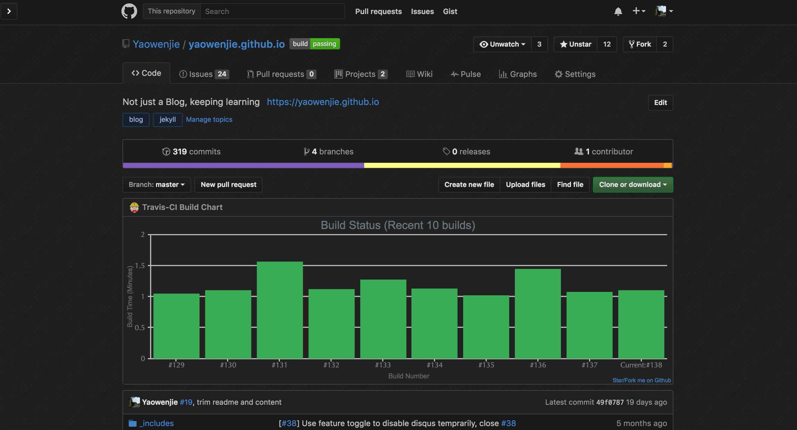

## Brief

This extension is to display __travis-ci__ status for repos in __github__. There is a visual chart which shows build status and  duration changes for recent 10 times.

## How to install it
You can click [this extension link](https://chrome.google.com/webstore/detail/github-travis-stat/ekkfhiophiaakmeppcnkblpbbjlnlnmh) directly, or search "__github travis stat__" on __Chrome web store__. Then add it to your chrome.

## Introduction
This repo's reference is originally from [WereHamster's github repo](https://github.com/wereHamster/github-travis-chrome-extension), which is no longer working since github's layout changed. So I changed the code to fit the new layout of github and did some refactor. Additionally, I added a __visual chart__ to show the last 10 times __build time__ and __build status__ of travis-ci. There is travis-ci pipeline status icon beside your github repos title and an awesome travis build chart in your repo page. As follows:

Also, you can see the build time and commit message detail when you hover on the column you're care about. Click the column, and you will go to the specific build in travis-ci.
Below is what the repositories list looks like, you can find which repos has been launched in travis-ci only if the repo is public:

On all pages, once you click the build icon, you will go to travis-ci page.

## How to install it in Developer mode
If you want to install it in Developer mode. First clone or fork this repo. Then, on your Chrome Extensions page, make sure "Developer mode" is checked. You can then click the "Load unpacked extension..." button and browse to the chrome directory of this repo.

## For development
Want to know more details of development or join the development of this plugin, please refer [here](src/README.md).

#### Feedback
You can give me your feedback on this extension by [github issue](https://github.com/Yaowenjie/travis-github-chrome-extension/issues).
Besides, sending your pull request on this repo would be better to improve it.

--------

## 安装
安装该插件，你可以直接点击[该链接](https://chrome.google.com/webstore/detail/github-travis-stat/ekkfhiophiaakmeppcnkblpbbjlnlnmh)，或者访问Chrome web store 并搜索“__github travis v2__”关键字，然后添加你的chrome浏览器即可。
如果你无法访问chrome web store，请下载[本repo最新的release版本](https://github.com/Yaowenjie/travis-github-chrome-extension/releases)，解压，然后在Chrome浏览器开发者模式下手动添加该插件（见上文"How to install it in Developer mode"）。

## 简介
该chrome插件为在github上的repo提供travis-ci运行状态和运行时间的图标（见上图1、2），你可以直观的了解到哪些repo（自己或者别人）开通了travis-ci的build，还可以看到特定repo近十次build的时间和状态变化，鼠标置于具体build上，还可查看具体build时间和message，点击还可以进入特定的travis-ci build页面。

## 开发
想了解开发细节参与该插件的开发，请参考[此处](src/README.md)。

## 反馈
欢迎在[github issue](https://github.com/Yaowenjie/travis-github-chrome-extension/issues)提出你的问题和建议，也欢迎有益的Pull Request。

--------
# Update History

- **2.1.6** - Fix duplicate badges in trending page.
- **2.1.5** - Fix badge display issue on repositories and stars.
- **2.1.4** - Fix badges on search page for its UI change.
- **2.1.3** - Fix #24 issue: build status badge show in wrong place of trending page.
- **2.1.2** - Fix console CSP error issue.
- **2.1.1** - Fix chart width issue.
- **2.1.0** - Support the build status badge on **Organization/Search/Trending** page, and fix page switching bug. Restructure and refactor code.
- **2.0.12** - Support [Stylish](https://chrome.google.com/webstore/detail/stylish-custom-themes-for/fjnbnpbmkenffdnngjfgmeleoegfcffe?hl=en) github theme (for **Github Dark** mainly), and trim title font.

- **2.0.11** - Fix the build status badge on **Repositories** tab, and add it into **Stars** tab.
- **2.0.10** - Add feature of **collapsing** chart by clicking chart header.
- **2.0.9** - Apply new layout of github.
